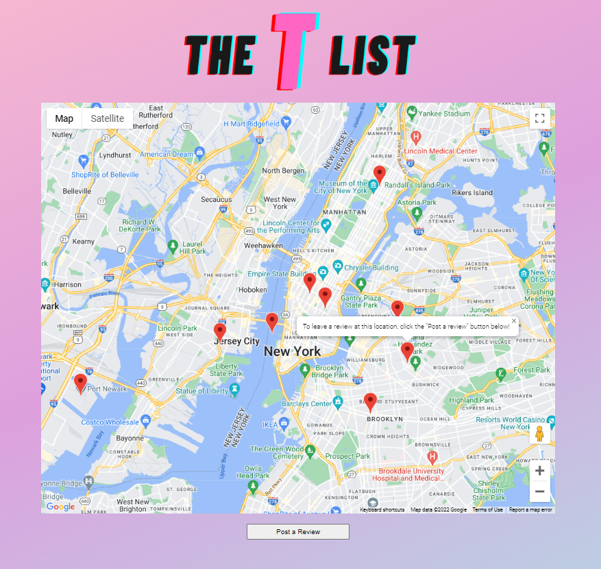

<div align="center">


# The T List
The T-List offers a visual platform spotlighting crowd-sourced reviews to improve access to trans-affirming care through aggregated data. Users can read reviews in their area marked by a location pin. If reviews don't exist at a location, users can add a new review there by placing a pin on the map, and then posting to the review form below. 

</div>



# Built With
- [React.js](https://reactjs.org/)
- [PostgreSQL](https://www.postgresql.org/)
- [Google Maps Platform API](https://developers.google.com/maps/)
- [Node.js](https://nodejs.org/en/)

# Getting Started

1. Clone the repo 
``` https://github.com/teamtant/the-t-list ```

2. Install npm packages
``` npm install ```

3. Run application and open up http://localhost:8080 in your browser
``` npm run dev ```

